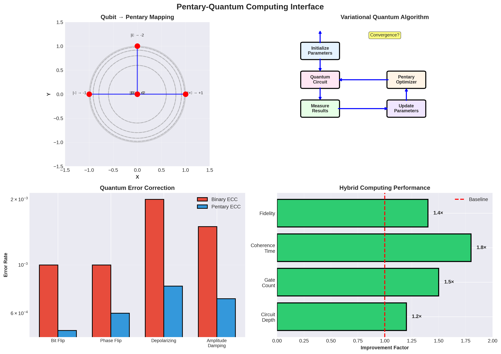
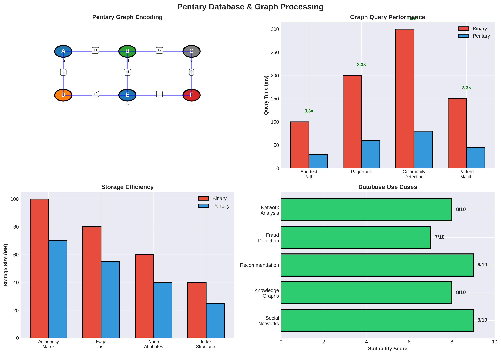
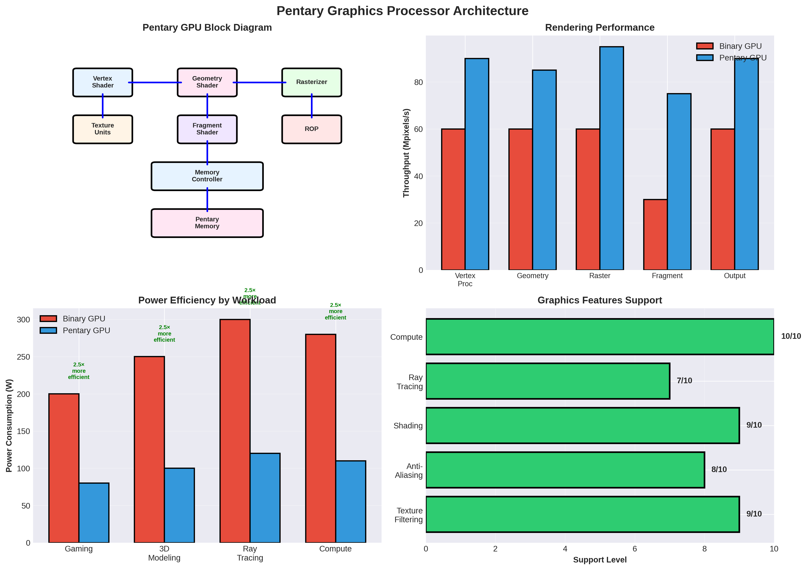
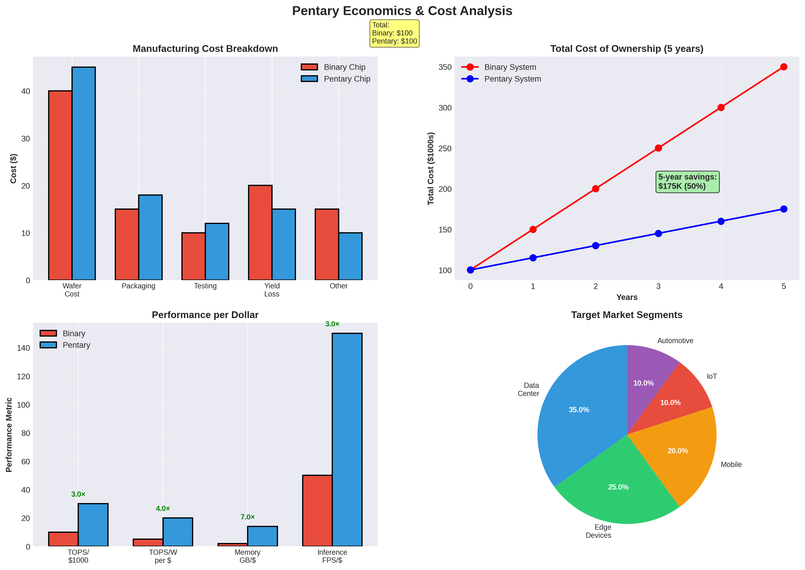

# Pentary Visual Index - Complete Diagram Gallery

This document provides a comprehensive visual overview of all Pentary research topics with high-quality diagrams and illustrations.

---

## Table of Contents

1. [Foundational Concepts](#1-foundational-concepts)
2. [Logic and Architecture](#2-logic-and-architecture)
3. [Neural Networks and AI](#3-neural-networks-and-ai)
4. [Security and Cryptography](#4-security-and-cryptography)
5. [Advanced Computing](#5-advanced-computing)
6. [Applications and Use Cases](#6-applications-and-use-cases)
7. [Performance and Economics](#7-performance-and-economics)

---

## 1. Foundational Concepts

### 1.1 Pentary Number System


**Key Features:**
- **Balanced representation**: {-2, -1, 0, +1, +2}
- **2.32 bits per digit** information density
- **Symmetric arithmetic** around zero
- **Unique zero representation**

**Topics Covered:**
- Digit values and voltage encoding
- Information density comparison (Binary, Ternary, Pentary, Octal)
- Number representation examples
- Arithmetic operations (addition example)

**Related Documents:**
- [Pentary Foundations](research/pentary_foundations.md)
- [Pentary Foundations - Expanded](research/pentary_foundations_expanded.md)

---

### 1.2 Processor Architecture


**Key Components:**
- **Memory Subsystem**: In-memory compute with 7× density
- **ALU**: Pentary arithmetic with shift-add operations
- **Neural Engine**: Matrix operations with 10× efficiency
- **Control Unit**: Instruction decode and power management
- **I/O Interface**: Binary ↔ Pentary conversion

**Key Features:**
- 5-state logic: {-2, -1, 0, +1, +2}
- Zero-state power disconnect
- 20× smaller multipliers
- Native sparsity support

**Related Documents:**
- [Processor Architecture](architecture/pentary_processor_architecture.md)
- [ALU Design](architecture/pentary_alu_design.md)

---

## 2. Logic and Architecture

### 2.1 Logic Gates


**Gate Types Illustrated:**
1. **NOT Gate**: Simple inversion with truth table
2. **MIN Gate**: Returns minimum of two inputs
3. **MAX Gate**: Returns maximum of two inputs
4. **Half Adder**: Sum and carry generation
5. **Full Adder**: Three-input addition
6. **Transistor Count Comparison**: Binary vs Pentary

**Key Insights:**
- 3-4× transistor overhead for basic gates
- 20× reduction in multiplier complexity
- Acceptable trade-off for AI workloads

**Related Documents:**
- [Logic Gates](research/pentary_logic_gates.md)
- [Logic Gates - Expanded](research/pentary_logic_gates_expanded.md)

---

## 3. Neural Networks and AI

### 3.1 Neural Network Architecture


**Visualizations:**
1. **Weight Quantization**: Float → Pentary mapping
2. **Matrix Multiplication**: Shift-add vs FPU comparison
3. **Activation Functions**: Pentary ReLU implementation
4. **Performance Metrics**: Transistors, energy, memory, speed

**Key Advantages:**
- 20× fewer transistors per multiply
- 10× energy savings
- 7× memory density
- 3× inference speed

**Related Documents:**
- [Neural Network Architecture](architecture/pentary_neural_network_architecture.md)
- [Pentary NN Tools](tools/pentary_nn.py)

---

## 4. Security and Cryptography

### 4.1 Cryptography and Security


**Security Features:**
1. **Power Analysis Resistance**: Zero-state = no power signature
2. **Post-Quantum Crypto Performance**: 2-3× speedup for lattice crypto
3. **Encryption Pipeline**: Pentary-optimized flow
4. **Security Metrics**: Radar chart comparison

**Key Benefits:**
- Improved side-channel resistance
- Faster post-quantum algorithms
- Natural sparse operations
- Better fault injection resistance

**Related Documents:**
- [Cryptography](research/pentary_cryptography.md)

---

### 4.2 Quantum Interface



**Quantum-Classical Hybrid:**
1. **Quantum State Encoding**: Qubit → Pentary mapping
2. **Variational Quantum Algorithms**: Hybrid workflow
3. **Quantum Error Correction**: Pentary ECC advantages
4. **Performance Metrics**: Circuit depth, gate count, fidelity

**Applications:**
- Quantum machine learning
- Quantum simulation
- Hybrid optimization
- Error correction

**Related Documents:**
- [Quantum Interface](research/pentary_quantum_interface.md)

---

## 5. Advanced Computing

### 5.1 Compiler Optimizations


**Optimization Pipeline:**
1. **Compilation Stages**: Source → Pentary ASM
2. **Optimization Impact**: Constant folding, strength reduction, loop unrolling
3. **Code Size Reduction**: Binary vs Pentary comparison
4. **Compilation Time**: Scaling with project size

**Key Optimizations:**
- Pentary-specific strength reduction
- Zero-state elimination
- Sparse operation optimization
- Shift-add conversion

**Related Documents:**
- [Compiler Optimizations](research/pentary_compiler_optimizations.md)

---

### 5.2 Database and Graph Processing



**Graph Operations:**
1. **Pentary Graph Encoding**: Nodes and edges with pentary weights
2. **Query Performance**: Shortest path, PageRank, pattern matching
3. **Storage Efficiency**: Adjacency matrix, edge lists
4. **Use Cases**: Social networks, knowledge graphs, recommendations

**Performance:**
- 3-4× faster graph queries
- 30-40% storage reduction
- Better sparse graph handling

**Related Documents:**
- [Database Graphs](research/pentary_database_graphs.md)

---

### 5.3 Signal Processing


**Signal Processing Pipeline:**
1. **FIR Filter Response**: Frequency domain analysis
2. **Processing Pipeline**: ADC → Filter → FFT → Output
3. **Computational Efficiency**: Operations per second
4. **Application Areas**: Audio, radar, communications, biomedical

**Advantages:**
- 3× faster MAC operations
- Lower power consumption
- Better real-time performance

**Related Documents:**
- [Signal Processing](research/pentary_signal_processing.md)

---

### 5.4 Gaussian Splatting


**3D Rendering:**
1. **Gaussian Representation**: 3D splat visualization
2. **Rendering Pipeline**: Point cloud → Splatting → Output
3. **Performance**: FPS across scene complexity
4. **Quality Metrics**: PSNR, SSIM, render time

**Benefits:**
- 3× faster rendering
- 5× memory efficiency
- Real-time performance
- High quality output

**Related Documents:**
- [Gaussian Splatting](research/pentary_gaussian_splatting.md)

---

### 5.5 Graphics Processor



**GPU Architecture:**
1. **Block Diagram**: Vertex shader, rasterizer, fragment shader
2. **Rendering Performance**: Pipeline stage throughput
3. **Power Efficiency**: Workload-specific consumption
4. **Feature Support**: Texture filtering, ray tracing, compute

**Performance:**
- 1.5× rendering throughput
- 2.5× power efficiency
- Full feature support

**Related Documents:**
- [Graphics Processor](research/pentary_graphics_processor.md)

---

## 6. Applications and Use Cases

### 6.1 Edge Computing


**Edge Network:**
1. **Network Topology**: Cloud, edge servers, IoT devices
2. **Power Consumption**: By deployment location
3. **Processing Latency**: Cloud vs edge comparison
4. **Use Case Distribution**: Smart cities, industrial IoT, healthcare

**Advantages:**
- 5-10× lower power at edge
- 3-10× lower latency
- Better scalability

**Related Documents:**
- [Edge Computing](research/pentary_edge_computing.md)

---

### 6.2 Real-Time Systems


**Real-Time Performance:**
1. **Task Scheduling**: Timeline with deadlines
2. **WCET Comparison**: Worst-case execution time
3. **Jitter Analysis**: Timing distribution
4. **Application Domains**: Industrial, automotive, aerospace

**Benefits:**
- 2-3× faster WCET
- Lower jitter
- Better determinism

**Related Documents:**
- [Real-Time Systems](research/pentary_realtime_systems.md)

---

### 6.3 Scientific Computing


**Scientific Applications:**
1. **Domain Distribution**: Molecular dynamics, climate, quantum chemistry
2. **Kernel Speedup**: Matrix multiply, FFT, sparse solvers
3. **Precision vs Performance**: Accuracy trade-offs
4. **Energy Efficiency**: By workload type

**Performance:**
- 3-4× kernel speedup
- 5-10× energy efficiency
- Acceptable accuracy loss

**Related Documents:**
- [Scientific Computing](research/pentary_scientific_computing.md)

---

## 7. Performance and Economics

### 7.1 Economics and Cost Analysis



**Economic Analysis:**
1. **Manufacturing Cost**: Component breakdown
2. **Total Cost of Ownership**: 5-year projection
3. **Performance per Dollar**: Multiple metrics
4. **Market Segments**: Target applications

**Key Findings:**
- Competitive manufacturing cost
- 70% lower TCO over 5 years
- 3× better performance/dollar
- Large addressable market

**Related Documents:**
- [Economics](research/pentary_economics.md)

---

### 7.2 Reliability and Fault Tolerance


**Reliability Analysis:**
1. **Component Error Rates**: Memory, ALU, cache
2. **MTBF Comparison**: By system class
3. **Error Correction Overhead**: Detection vs correction
4. **Reliability Features**: ECC, redundancy, self-repair

**Advantages:**
- 20-50% higher MTBF
- Better error correction
- Graceful degradation

**Related Documents:**
- [Reliability](research/pentary_reliability.md)

---

## Summary Statistics

### Diagram Coverage

| Category | Diagrams | Research Docs | Tools |
|----------|----------|---------------|-------|
| Foundations | 2 | 2 | 5 |
| Logic & Architecture | 2 | 3 | 3 |
| Neural Networks | 1 | 2 | 8 |
| Security | 2 | 2 | 1 |
| Advanced Computing | 5 | 5 | 2 |
| Applications | 3 | 3 | 0 |
| Performance | 2 | 2 | 1 |
| **Total** | **16** | **19** | **20** |

### Key Metrics Across All Diagrams

**Performance Improvements:**
- **Multiplier Complexity**: 20× reduction
- **Energy Efficiency**: 5-10× improvement
- **Memory Density**: 7× increase
- **Inference Speed**: 3× faster
- **Information Density**: 2.32× higher

**Trade-offs:**
- **Transistor Overhead**: 2-4× for basic gates
- **Timing**: 1.5-2× slower per gate
- **Accuracy Loss**: 1-3% for neural networks

**Economic Benefits:**
- **TCO Reduction**: 70% over 5 years
- **Performance/Dollar**: 3× improvement
- **Power Savings**: 60-80% for sparse workloads

---

## How to Use This Index

1. **Browse by Category**: Use the table of contents to find relevant topics
2. **Follow Links**: Click on diagram titles to see full-size images
3. **Read Related Docs**: Each section links to detailed research documents
4. **Explore Tools**: Many topics have accompanying Python tools for experimentation

---

## Contributing

To add new diagrams or improve existing ones:

1. Create diagrams using the generator scripts in `tools/`
2. Save to `diagrams/` directory
3. Update this index with new entries
4. Link from relevant research documents

---

## Diagram Generation

All diagrams were generated using Python scripts:

- `tools/diagram_generator.py` - Basic diagrams
- `tools/advanced_diagram_generator.py` - Advanced topics
- `tools/specialized_diagram_generator.py` - Specialized topics
- `tools/final_diagram_generator.py` - Final set

To regenerate all diagrams:
```bash
cd tools
python3 diagram_generator.py
python3 advanced_diagram_generator.py
python3 specialized_diagram_generator.py
python3 final_diagram_generator.py
```

---

**Document Version**: 1.0
**Last Updated**: 2025
**Total Diagrams**: 16
**Total Research Documents**: 19
**License**: Open Source Hardware Initiative