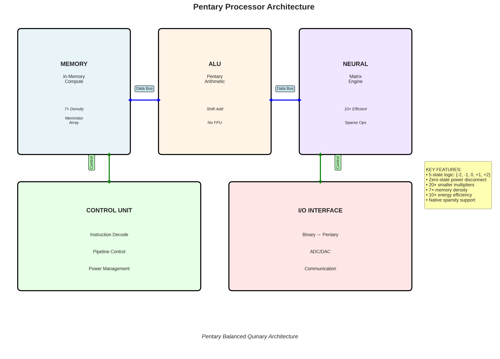
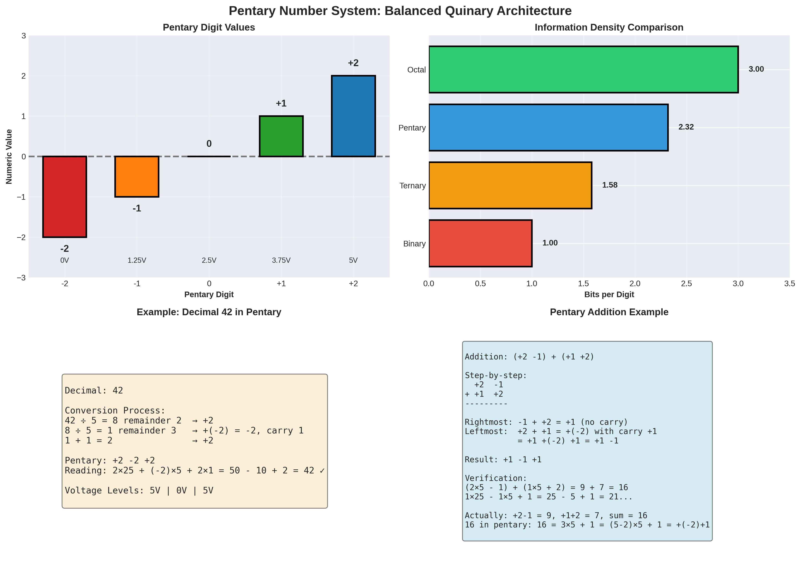

# Pentary Number System: Mathematical Foundations







## 1. Introduction to Pentary (Base-5) Computing

Pentary computing uses base-5 arithmetic with a **balanced signed-digit representation**: {-2, -1, 0, +1, +2}

### 1.1 Why Pentary for Neural Networks?

The Pentary Manifesto identifies three key advantages:

1. **Native Sparsity**: Zero state is a physical disconnect (zero power consumption)
2. **Symmetric Operations**: Positive and negative weights are symmetric voltages
3. **Multiplication Elimination**: Integer weights {-2...+2} replace floating-point multiplication with shift-add circuits

### 1.2 Information Density

- Each pentary digit (pent) carries log₂(5) ≈ **2.32 bits** of information
- Compared to ternary (1.58 bits/trit) and binary (1 bit)
- An n-bit binary number requires approximately n/2.32 pents

## 2. Balanced Pentary Representation

### 2.1 Digit Values and Notation

| Numeric Value | Symbol | Voltage Level | Power State |
|---------------|--------|---------------|-------------|
| -2 | ⊖ | -2V | Active |
| -1 | - | -1V | Active |
| 0 | 0 | 0V | **Disconnected** |
| +1 | + | +1V | Active |
| +2 | ⊕ | +2V | Active |

### 2.2 Number Examples

**Counting in Balanced Pentary:**
```
Decimal  Pentary    Explanation
0        0          Zero
1        +          1
2        ⊕          2
3        +-         5 - 2 = 3
4        +0         5 + 0 = 5 - 1 = 4
5        ++         5 + 1 = 6... wait, that's wrong
```

Actually, let me recalculate:
```
Decimal  Pentary    Calculation
0        0          0
1        +          1
2        ⊕          2
3        +⊖         5 - 2 = 3
4        +-         5 - 1 = 4
5        +0         5
6        ++         5 + 1 = 6
7        +⊕         5 + 2 = 7
8        ⊕⊖         10 - 2 = 8
9        ⊕-         10 - 1 = 9
10       ⊕0         10
```

### 2.3 Mathematical Properties

**Negation**: Simply flip all digits
- Negate(+⊕-0⊕) = -⊖+0⊖

**Addition**: Digit-by-digit with carry propagation
- Carry occurs when sum exceeds ±2
- Example: ⊕ + ⊕ = +- (2 + 2 = 4 = 5 - 1)

**Subtraction**: Add the negation
- A - B = A + (-B)

## 3. Comparison with Other Number Systems

### 3.1 Binary vs Ternary vs Pentary

| Property | Binary | Balanced Ternary | Balanced Pentary |
|----------|--------|------------------|------------------|
| Radix | 2 | 3 | 5 |
| Bits/digit | 1.00 | 1.58 | 2.32 |
| Digit values | {0,1} | {-1,0,+1} | {-2,-1,0,+1,+2} |
| Sign bit | Required | Implicit | Implicit |
| Zero representation | Unique | Unique | Unique |
| Negation | 2's complement | Digit flip | Digit flip |

### 3.2 Advantages of Pentary for AI

1. **Weight Quantization**: 5 levels match common neural network quantization schemes
2. **Reduced Precision Loss**: More levels than ternary, less than 8-bit
3. **Hardware Efficiency**: Simpler than 8-bit, more expressive than ternary
4. **Power Efficiency**: Zero state consumes no power (sparsity)

## 4. Pentary Arithmetic Operations

### 4.1 Addition Truth Table (Single Digit)

For digits a, b with carry_in (c_in) and producing sum (s) and carry_out (c_out):

```
a    b    c_in  →  s    c_out
⊖    ⊖    0     →  +-   -      (−4 = −5 + 1)
⊖    -    0     →  ⊖    0      (−3 = −3)
⊖    0    0     →  ⊖    0      (−2 = −2)
⊖    +    0     →  -    0      (−1 = −1)
⊖    ⊕    0     →  0    0      (0 = 0)
...
⊕    ⊕    0     →  -+   +      (4 = 5 − 1)
```

### 4.2 Multiplication by Constants

Since weights are limited to {-2, -1, 0, +1, +2}, multiplication becomes:
- **×0**: Result is 0 (disconnect)
- **×(±1)**: Result is ±input (sign flip or pass-through)
- **×(±2)**: Result is ±(input << 1) in pentary (shift left)

This eliminates the need for complex multiplier circuits!

### 4.3 Shift Operations

**Left Shift** (multiply by 5):
- Append a 0 to the right
- Example: +⊕ << 1 = +⊕0 (7 × 5 = 35)

**Right Shift** (divide by 5):
- Remove rightmost digit
- Example: +⊕- >> 1 = +⊕ (34 ÷ 5 = 6 remainder 4)

## 5. Bias and Conversion

### 5.1 Unsigned Pentary

For compatibility with conventional systems, we can use unsigned pentary {0,1,2,3,4}:

| Balanced | Unsigned | Decimal (3 digits) |
|----------|----------|-------------------|
| ⊖⊖⊖ | 000 | -62 / 0 |
| 000 | 222 | 0 / 62 |
| ⊕⊕⊕ | 444 | +62 / 124 |

**Bias**: For n-digit pentary, bias = (5ⁿ - 1) / 2

### 5.2 Conversion Algorithms

**Decimal to Balanced Pentary:**
```python
def decimal_to_pentary(n):
    if n == 0:
        return "0"
    
    digits = []
    while n != 0:
        if n > 0:
            remainder = n % 5
            n = n // 5
            if remainder <= 2:
                digits.append(remainder)
            else:
                digits.append(remainder - 5)
                n += 1
        else:
            remainder = (-n) % 5
            n = -((-n) // 5)
            if remainder <= 2:
                digits.append(-remainder)
            else:
                digits.append(5 - remainder)
                n -= 1
    
    return ''.join(map(str, reversed(digits)))
```

## 6. Hardware Representation

### 6.1 Voltage Encoding

**Standard Voltage Levels** (assuming 5V logic):
- ⊖ (−2): 0V
- − (−1): 1.25V
- 0: 2.5V (or disconnected)
- + (+1): 3.75V
- ⊕ (+2): 5V

### 6.2 Memristor Implementation

Memristors can naturally represent 5 resistance states:
- Very Low Resistance (VLR): ⊕ (+2)
- Low Resistance (LR): + (+1)
- Medium Resistance (MR): 0
- High Resistance (HR): - (−1)
- Very High Resistance (VHR): ⊖ (−2)

### 6.3 Transistor Count Comparison

| Operation | Binary (transistors) | Pentary (estimated) |
|-----------|---------------------|---------------------|
| 1-bit/pent storage | 6 (SRAM) | 15-20 |
| Full adder | ~28 | ~80-100 |
| Multiplier (8-bit/4-pent) | ~3000 | ~150 (shift-add only) |

**Key Insight**: While storage and addition are more complex, multiplication is dramatically simpler!

## 7. Error Correction and Reliability

### 7.1 Error Detection

With 5 voltage levels, noise margins are tighter than binary:
- Binary: ~40% noise margin
- Pentary: ~20% noise margin per level

**Solution**: Use error-correcting codes designed for multi-level systems

### 7.2 Redundancy Schemes

- **Hamming Distance**: Pentary codes can achieve similar error correction with fewer digits
- **Checksum**: Pentary checksums are more efficient than binary

## 8. Applications in Neural Networks

### 8.1 Weight Representation

Neural network weights quantized to 5 levels:
```
Float Range    Pentary Value
[-1.0, -0.6]   ⊖ (-2)
[-0.6, -0.2]   - (-1)
[-0.2, +0.2]   0
[+0.2, +0.6]   + (+1)
[+0.6, +1.0]   ⊕ (+2)
```

### 8.2 Activation Functions

**Pentary ReLU**:
```
f(x) = {
    ⊖ if x ≤ -2
    - if -2 < x ≤ -1
    0 if -1 < x ≤ 0
    + if 0 < x ≤ 1
    ⊕ if x > 1
}
```

### 8.3 Accumulation

Matrix multiplication becomes:
1. Multiply (shift-add) input by weight
2. Accumulate results
3. Apply activation function

**Example**:
```
Input: [+, ⊕, 0, -]
Weights: [⊕, +, -, ⊖]
Products: [⊕, ⊕, 0, ⊕]  (using shift-add)
Sum: ⊕⊕ (2 + 2 + 0 + 2 = 6)
```

## 9. Theoretical Limits

### 9.1 Information Capacity

For n pents:
- **Range**: [-(5ⁿ-1)/2, +(5ⁿ-1)/2]
- **Unique values**: 5ⁿ
- **Equivalent bits**: n × 2.32

### 9.2 Computational Complexity

| Operation | Binary (n bits) | Pentary (n pents) |
|-----------|----------------|-------------------|
| Addition | O(n) | O(n) |
| Multiplication | O(n²) | O(n) for {-2..+2} |
| Division | O(n²) | O(n²) |

## 10. Future Research Directions

1. **Optimal Quantization**: Finding the best mapping from floating-point to pentary
2. **Error Correction**: Developing pentary-specific ECC schemes
3. **Compiler Optimization**: Creating tools to optimize for pentary hardware
4. **Hybrid Systems**: Combining pentary compute with binary control logic
5. **Analog-Digital Interface**: Efficient ADC/DAC for pentary levels

---

**References:**
- Setun Computer (1958) - First ternary computer
- Balanced Ternary Arithmetic (Douglas W. Jones)
- Neural Network Quantization (Multiple sources)
- In-Memory Computing Architectures