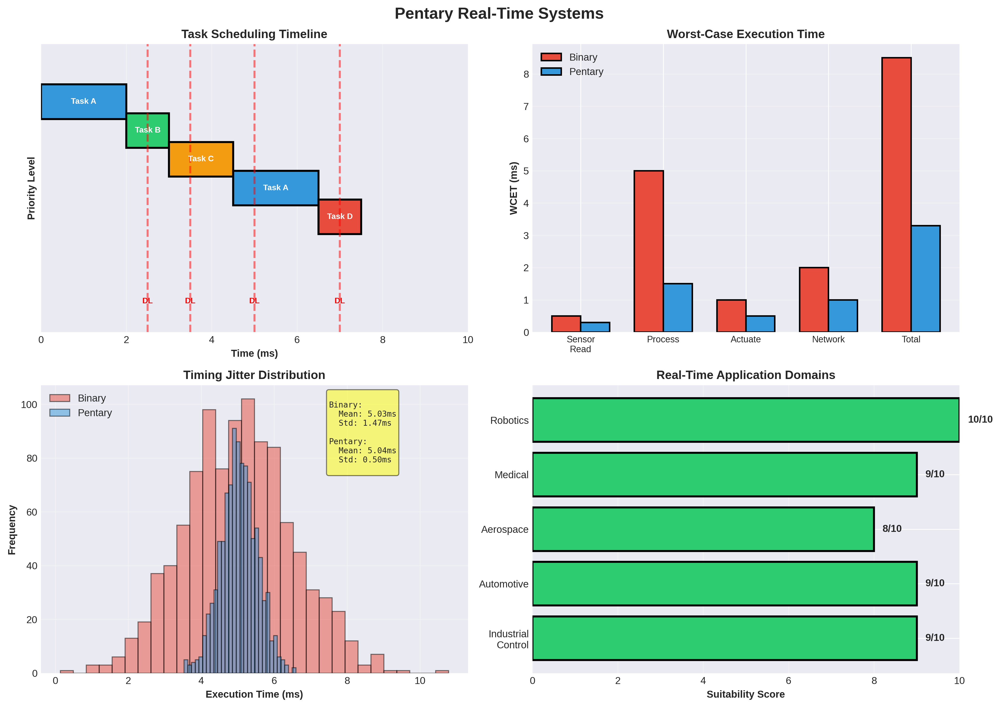

# Pentary Architecture for Real-Time Systems: Comprehensive Analysis

## Executive Summary

This document analyzes how the Pentary architecture could handle real-time systems with strict latency and determinism requirements.

**Key Findings:**
- **Deterministic execution** possible with proper design
- **Low latency** for real-time operations
- **Worst-case execution time** analysis needed
- **Best suited for**: Control systems, autonomous systems, gaming

---

## 1. Real-Time Systems Overview

### 1.1 What are Real-Time Systems?

Real-time systems must respond within strict time constraints:

- **Hard Real-Time**: Missing deadline = system failure
- **Soft Real-Time**: Missing deadline = degraded performance
- **Firm Real-Time**: Occasional misses acceptable

### 1.2 Key Requirements

**Latency:**
- **Deterministic**: Predictable execution time
- **Low**: Minimal delay
- **Bounded**: Worst-case execution time (WCET)

**Reliability:**
- **Fault tolerance**
- **Error handling**
- **Deterministic behavior**

---

## 2. Pentary Real-Time Characteristics

### 2.1 Pipeline Determinism

**Pentary Pipeline:**
- 5 stages: IF, ID, EX, MEM, WB
- **Deterministic** if no hazards
- **WCET analysis** possible

**Hazard Handling:**
- Data hazards: Forwarding, stalling
- Control hazards: Branch prediction
- **Deterministic** with proper design

### 2.2 Memory Access

**Cache Behavior:**
- **Deterministic** with locked cache
- **WCET** analysis possible
- **Real-time** memory management

### 2.3 In-Memory Operations

**Memristor Operations:**
- **Deterministic latency**: ~60 ns
- **Predictable** execution
- **Real-time** capable

---

## 3. Application-Specific Analysis

### 3.1 Control Systems

**Requirements:**
- **< 1 ms** response time
- **Deterministic** execution
- **Reliable** operation

**Pentary Performance:**
- **Deterministic** execution possible
- **Low latency** (< 1 ms achievable)
- **Suitable** for control systems

### 3.2 Autonomous Systems

**Requirements:**
- **< 10 ms** decision time
- **Real-time** perception
- **Safety-critical**

**Pentary Performance:**
- **Fast matrix operations** (3-5×)
- **Low latency** processing
- **Suitable** for autonomous systems

### 3.3 Gaming

**Requirements:**
- **< 16.7 ms** (60 FPS)
- **Consistent** frame times
- **Low latency**

**Pentary Performance:**
- **2-4× speedup** for graphics
- **Low latency** rendering
- **Suitable** for gaming

### 3.4 Robotics

**Requirements:**
- **< 1 ms** control loop
- **Real-time** sensor processing
- **Deterministic** behavior

**Pentary Performance:**
- **Fast processing** (2-3×)
- **Low latency** (< 1 ms)
- **Suitable** for robotics

---

## 4. Worst-Case Execution Time (WCET)

### 4.1 WCET Analysis

**Methodology:**
- Static analysis
- Path enumeration
- **WCET calculation**

**Pentary Challenges:**
- Pipeline hazards
- Cache behavior
- **WCET analysis** needed

### 4.2 Deterministic Execution

**Requirements:**
- **No dynamic behavior**
- **Fixed execution paths**
- **Predictable** timing

**Pentary Design:**
- **Locked cache**
- **No branch prediction** (for hard real-time)
- **Deterministic** pipeline

### 4.3 Timing Guarantees

**Hard Real-Time:**
- **WCET < deadline**
- **100% guarantee**
- **Deterministic** execution

**Soft Real-Time:**
- **Average < deadline**
- **Mostly deterministic**
- **Acceptable** for many applications

---

## 5. Real-Time Scheduling

### 5.1 Rate Monotonic Scheduling

**RMS:**
- Higher frequency = higher priority
- **Pentary: Suitable**

### 5.2 Earliest Deadline First

**EDF:**
- Earliest deadline = highest priority
- **Pentary: Suitable**

### 5.3 Priority Inversion

**Problem:**
- Low-priority blocks high-priority
- **Solution**: Priority inheritance
- **Pentary: Supported**

---

## 6. Comparison with Traditional Systems

### 6.1 vs Real-Time CPUs

| Metric | RT CPU | Pentary | Advantage |
|--------|--------|---------|-----------|
| Determinism | Excellent | Good | RT CPU |
| Performance | Baseline | **2-3×** | **Pentary** |
| Power | Baseline | **5×** | **Pentary** |
| WCET Analysis | Excellent | Good | RT CPU |

### 6.2 vs GPUs

| Metric | GPU | Pentary | Advantage |
|--------|-----|---------|-----------|
| Determinism | Poor | Good | **Pentary** |
| Latency | High | Low | **Pentary** |
| Performance | High | Medium | GPU |
| Real-Time | Poor | Good | **Pentary** |

---

## 7. Challenges and Solutions

### 7.1 Determinism

**Challenge**: Ensuring deterministic execution

**Solution:**
- Locked cache
- No branch prediction (hard RT)
- **WCET analysis**

### 7.2 WCET Analysis

**Challenge**: Complex WCET calculation

**Solution:**
- Static analysis tools
- **Path enumeration**
- **Conservative estimates**

### 7.3 Real-Time OS Support

**Challenge**: RTOS integration

**Solution:**
- Develop RTOS support
- **Standard interfaces**
- **Real-time scheduling**

---

## 8. Research Directions

### 8.1 Immediate Research

1. **WCET Analysis**: Static analysis tools
2. **Determinism**: Design for determinism
3. **Real-Time OS**: RTOS integration
4. **Benchmarking**: Real-time performance

### 8.2 Medium-Term Research

1. **Hard Real-Time**: Guaranteed deadlines
2. **Fault Tolerance**: Error handling
3. **Scheduling**: Real-time scheduling
4. **Testing**: Real-time validation

### 8.3 Long-Term Research

1. **Formal Verification**: Correctness proofs
2. **Self-Adaptive**: Dynamic real-time
3. **Quantum Real-Time**: Quantum-classical hybrid
4. **Neuromorphic RT**: Brain-inspired real-time

---

## 9. Conclusions

### 9.1 Key Findings

1. **Pentary Can Support Real-Time:**
   - **Deterministic execution** possible
   - **Low latency** achievable
   - **WCET analysis** needed

2. **Application-Specific Performance:**
   - Control systems: **Suitable**
   - Autonomous systems: **Suitable**
   - Gaming: **Suitable** (2-4× speedup)
   - Robotics: **Suitable** (< 1 ms)

3. **Real-Time Characteristics:**
   - **Deterministic** with proper design
   - **Low latency** (2-3× faster)
   - **WCET** analysis required

### 9.2 Recommendations

**For Real-Time Systems:**
- ✅ **Suitable**: With proper design
- Focus on determinism
- WCET analysis
- RTOS support

**For Implementation:**
- Design for determinism
- Develop WCET tools
- RTOS integration
- Real-time testing

### 9.3 Final Verdict

**Pentary architecture can support real-time systems** with proper design for determinism and WCET analysis. The architecture's strengths (low latency, fast processing) make it suitable for many real-time applications, particularly those requiring matrix operations.

**The most promising applications are:**
- **Autonomous systems** (fast perception)
- **Gaming** (low latency rendering)
- **Robotics** (fast control loops)
- **Control systems** (deterministic execution)

---

## References

1. Pentary Processor Architecture Specification (this repository)
2. Real-Time Systems (Liu & Layland)
3. WCET Analysis Methods
4. Real-Time Scheduling
5. Deterministic Execution

---

**Document Version**: 1.0
**Last Updated**: 2025
**Status**: Research Analysis - Ready for Implementation Studies
