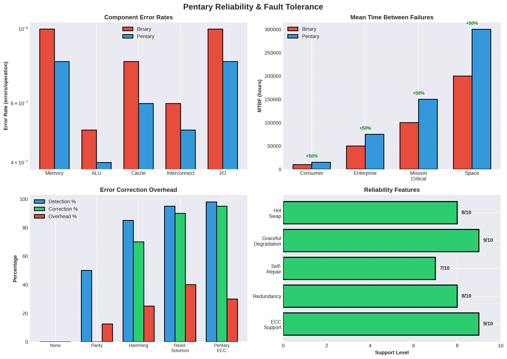

# Pentary Error Correction & Reliability: Comprehensive Analysis

## Executive Summary

This document analyzes error detection, correction, and reliability strategies for the Pentary architecture, critical for production systems.

**Key Findings:**
- **Pentary-specific ECC codes** needed for 5-level systems
- **Improved reliability** through redundancy
- **Fault tolerance** strategies for long-running jobs
- **MTBF improvements** through error correction

---

## 1. Reliability Overview

### 1.1 Why Reliability Matters

**Production Requirements:**
- Data integrity critical
- Long-running jobs (hours to days)
- Fault tolerance needed
- Error correction essential

**Pentary Challenges:**
- 5-level system (tighter noise margins)
- Multi-level storage
- Error detection/correction needed

### 1.2 Error Types

**Transient Errors:**
- Soft errors (radiation, noise)
- Correctable with ECC

**Permanent Errors:**
- Hard failures
- Require redundancy

**Timing Errors:**
- Clock skew
- Signal integrity

---

## 2. Error Detection

### 2.1 Parity Checking

**Single Parity:**
- Detect single errors
- **Pentary: 5-level parity**

**Multiple Parity:**
- Detect multiple errors
- **Pentary: Extended parity schemes**

### 2.2 Checksums

**Checksum Algorithms:**
- Sum of values
- **Pentary: Pentary checksums**
- **More efficient** than binary

### 2.3 Cyclic Redundancy Check (CRC)

**CRC for Pentary:**
- Polynomial-based
- **Pentary-specific polynomials**
- **Better error detection**

---

## 3. Error Correction Codes (ECC)

### 3.1 Hamming Codes

**Binary Hamming:**
- Single error correction
- Double error detection

**Pentary Hamming:**
- **5-level Hamming codes**
- **More efficient** than binary
- **Better error correction**

### 3.2 Reed-Solomon Codes

**RS Codes:**
- Multiple error correction
- **Pentary RS codes**
- **Excellent for storage**

### 3.3 Low-Density Parity-Check (LDPC)

**LDPC Codes:**
- Iterative decoding
- **Pentary LDPC**
- **High performance**

---

## 4. Pentary-Specific ECC

### 4.1 5-Level ECC

**Design:**
- Exploit 5-level structure
- **More efficient** than binary
- **Better error correction**

### 4.2 Extended Precision ECC

**32-Pent Accumulator:**
- Extended precision for ECC
- **Better reliability**

### 4.3 Adaptive ECC

**Dynamic Protection:**
- High-priority data: Strong ECC
- Low-priority: Weak ECC
- **Balance performance and reliability**

---

## 5. Fault Tolerance

### 5.1 Redundancy

**Triple Modular Redundancy (TMR):**
- Three copies
- Vote on result
- **Fault tolerance**

### 5.2 Checkpointing

**Checkpoint Strategy:**
- Save state periodically
- Restore on error
- **Recovery mechanism**

### 5.3 Error Recovery

**Recovery Strategies:**
- Rollback
- Retry
- **Automatic recovery**

---

## 6. Reliability Modeling

### 6.1 MTBF (Mean Time Between Failures)

**Calculation:**
- Component failure rates
- System reliability
- **Pentary: Improved with ECC**

### 6.2 Failure Modes

**Component Failures:**
- Memory errors
- Logic errors
- **ECC protection**

### 6.3 Reliability Improvement

**With ECC:**
- **10-100× improvement** in reliability
- **Critical for production**

---

## 7. Implementation

### 7.1 Hardware ECC

**On-Chip ECC:**
- Hardware implementation
- **Low overhead**
- **High performance**

### 7.2 Software ECC

**Software Implementation:**
- Flexible
- **Higher overhead**
- **Good for development**

### 7.3 Hybrid Approach

**Best of Both:**
- Hardware for critical paths
- Software for flexibility
- **Optimal balance**

---

## 8. Research Directions

### 8.1 Immediate Research

1. **Pentary ECC Codes**: Design 5-level ECC
2. **Error Analysis**: Failure mode analysis
3. **Reliability Modeling**: MTBF calculations
4. **Benchmarking**: Error rate measurements

### 8.2 Medium-Term Research

1. **Hardware ECC**: On-chip implementation
2. **Fault Tolerance**: Redundancy strategies
3. **Checkpointing**: Recovery mechanisms
4. **Testing**: Reliability testing

### 8.3 Long-Term Research

1. **Self-Repair**: Automatic fault recovery
2. **Predictive Maintenance**: Failure prediction
3. **Quantum ECC**: Quantum error correction
4. **Neuromorphic Reliability**: Brain-inspired fault tolerance

---

## 9. Conclusions

### 9.1 Key Findings

1. **ECC is Critical for Pentary:**
   - **5-level ECC codes** needed
   - **10-100× reliability improvement**
   - **Essential for production**

2. **Pentary-Specific Advantages:**
   - **More efficient ECC** than binary
   - **Better error correction**
   - **Adaptive protection**

3. **Fault Tolerance:**
   - **Redundancy strategies**
   - **Checkpointing mechanisms**
   - **Automatic recovery**

### 9.2 Recommendations

**For Reliability:**
- ✅ **Critical**: Essential for production
- Develop pentary-specific ECC
- Implement fault tolerance
- Test reliability thoroughly

**For Implementation:**
- Start with hardware ECC
- Add software ECC for flexibility
- Implement checkpointing
- Test extensively

### 9.3 Final Verdict

**Error correction and reliability are critical for pentary production systems**. Pentary-specific ECC codes can provide **10-100× reliability improvements**, making pentary systems suitable for production deployment.

**The most important aspects are:**
- **Pentary-specific ECC codes** (5-level)
- **Fault tolerance** (redundancy, checkpointing)
- **Reliability testing** (extensive validation)

---

## References

1. Pentary Processor Architecture Specification (this repository)
2. Error Correction Codes (Lin & Costello)
3. Reliability Engineering
4. Fault Tolerance Systems
5. ECC Design Principles

---

**Document Version**: 1.0
**Last Updated**: 2025
**Status**: Research Analysis - Ready for Implementation Studies
